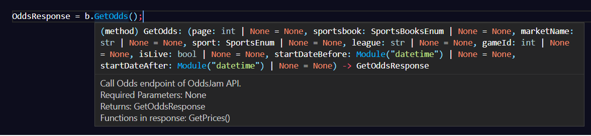

# <code>oddsjam-api</code>: A lightweight wrapper OddsJam API wrapper

## What is <code>oddsjam-api</code>?
<code>oddsjam-api</code> is a fast, lightweight wrapper for the [OddsJam API](https://developer.oddsjam.com/getting-started). It strives to be as intuitive to use as possible, providing strongly typed requests and responses to ensure predictability and consistency.

## How do I use it?
Start by creating an instance of the <code>OddsJamClient</code>:

```
    Client = OddsJamClient(YOUR_API_KEY);
```

Then simply call whichever function you'd like to:

```    
    from OddsJamClient import OddsJamClient;
    from Enum.SportsEnum import SportsEnum;
    Client = OddsJamClient(YOUR_API_KEY);
    GamesResponse = Client.GetGames();
```

Parameters are not required for any function call, but can be provided as desired:

```
    from OddsJamClient import OddsJamClient;
    from Enum.SportsEnum import SportsEnum;
    Client = OddsJamClient(YOUR_API_KEY);
    GamesResponse = Client.GetGames(league='ncaa', sport=SportsEnum.football);
```

And use either the built-in functions for the response type:

```
    GameIds = GamesResponse.GetGameIds();
```

Or work with the raw response from the API:

```
    Raw = GamesResponse.RawResponse;
    Jobj = json.loads(raw);
```

All parameters are optional, and are listed in the docstring of each function in the Client:

 

In addition to built in functions in the responses, individual objects/properties of the parsed responses can also be accessed:

```
    from OddsJamClient import OddsJamClient;
    Client = OddsJamClient(YOUR_API_KEY);
    GamesResponse = Client.GetGames();
    GameOne = GamesResponse.Games[0];
    print(GameOne.ID)
    print(GameOne.Sport)
```